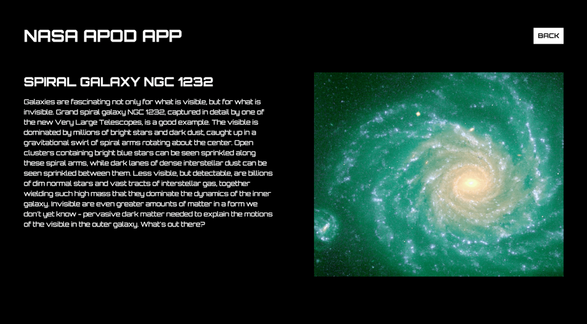

# Wiser | Full Stack Developer Task

## Introduction

### About this Task

This task should be completed to be considered for the Full Stack Developer position at Wiser. The task will test your knowledge of JavaScript (ReactJS), styling and ability to accurately translate design files into code, write a backend API, implement DevOps systems, and maintain well organized code.

### Instructions

You will need to setup two repositories: a front end repository, and a back end repository. Additionally, some infrastructure and DevOps systems will need to be configured.

Once this is all complete, draft a debriefing with relevant links and email it to <engineering@wearewiser.com>.

## Tasks

There will be three primary tasks to complete: a front end task, a back end task, and a DevOps task. Each task will have their own requirements and evaluation criteria. In addition to specific task criteria, all tasks will be evaluated on these important metrics:
- Code quality
- Git practices
- Communication of intent
- Well designed architecture
- Methodical usage of capitalization

### Front End Task

Build an image gallery by fetching data from the NASA [Astronomy Picture of the Day](https://api.nasa.gov/) API.

The front end repository can be setup using [Create React App](https://github.com/facebook/create-react-app) by running ```npm init react-app```.

There should be a route for the `Home` component and a dynamic route for the `ImageDetails` component.

#### Home

- Display 6 random images from the NASA APOD API, along with their corresponding titles.


#### ImageDetails

- Each image displayed on the `Home` page component should be clickable.
- On click of each image, a dynamic route should generated. The route should navigate to the `ImageDetails` page component, which should display the `url`, `title` and `explanation` of the image that was clicked on.
- There should be a back button to return to the home page.



#### Bonus Points

- The `ImageDetails` route path should use the `title` of the image that was clicked. For example in the above design, the path would be `/image/spiral-galaxy-ngc-1232`, opposed to a generic number ID such as `/image/1`.
- Sometimes the APOD API returns a video instead of an image. If this happens, the application should display the video thumbnail as an image, instead of the video.
- Add text that reads "Loading images" to the `Home` component. This text should disappear once the images are displayed.

#### Notes

- Please ensure this task is built using the ReactJS library.
- Feel free to install any additional packages that you feel are necessary.
- The app should be responsive for desktop and mobile devices.
- The app should be cross-browser compatible, the latest versions of Safari, Firefox and Chrome is fine.
- Front end code should be in its own public repository

### Back End Task

Build a contact form. You will need to create an API server, and add the form to your existing app.

The back end repository can be setup using [Create NodeTS](https://github.com/johnfedoruk/create-nodets) by running ```npm init nodets```.

#### Contact API

- Build on Express in TypeScript
- API endpoint should be implemented with RESTful practices
- When a form is submitted, an email should notify <engineering@wearewiser.com> about the contact details.
- Back-end data validation
- The following properties should be processed

| Property   | Key        | Data Type |
|------------|------------|-----------|
| First name | first_name | String    |
| Last name  | last_name  | String    |
| Birthday   | birthdate  | Date      |
| Subject    | subject    | String    |
| Body       | body       | String    |
| CV         | cv         | File      |

#### Contact Form

- Refactor your original front end app to handle user input
- Contact form should send user data to RESTful API for processing
- Error handling required 
- Well designed form
- Client side validation

#### Bonus Points

- Fault tolerance against SMTP errors
- Stateless API
- TDD
- Rate limiting endpoints
- API Authentication and resource protection
- Standardized logging

### DevOps Task

Your final task will require that you setup some infrastructure to host your front end and back end applications, and will also require that you build a delivery system for continuous integration and delivery.

#### Hosting

- Host the front end code
- Host the back end code
- Accessible on public internet
- Must be configured with secure TLS

#### CI/CD

- Any system you like
- Configured to handle front end and back end code independently
- Must include secret MGMT to protect tokens / crypto keys / API keys
- Must be triggered by git
- Must run quality analysis as part of continuous integration
  - Linting
  - Unit Testing
- Must auto deploy to hosted environment as part of continuous delivery 

#### Bonus Points

- Dependency analysis as part of CI
- Hosting on Kubernetes
- Hosting production and non-production environments
- Tag (git tag) based environment selection for prod and non prod deployments
- Implements git workflow here: https://github.com/wearewiser/contributing

## Good Luck!

If you have any questions, please feel free to email <engineering@wearewiser.com>.